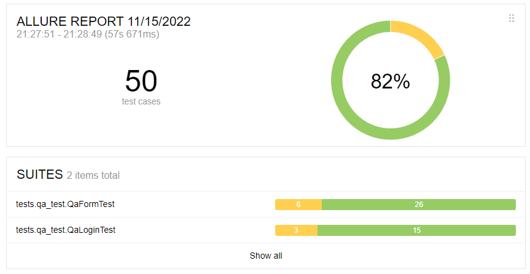

# TestProtey

#### Тестовое задания для НТЦ Протей

Стэк:  
* Java11  
* Maven  
* Selenium  
* Junit5    

Можно стартовать на linux или windows.  
По умолчанию установлен старт на хроме, но можно поменять на firefox в конфиге.  
Тестовый html файл запускается автоматически, просто запустить: `mvn clean test`.  
Генерация отчета: `mvn allure:report`.  
Отчет будет лежать в `target/allure-results/site/index.html`

Скриншот отчета:

